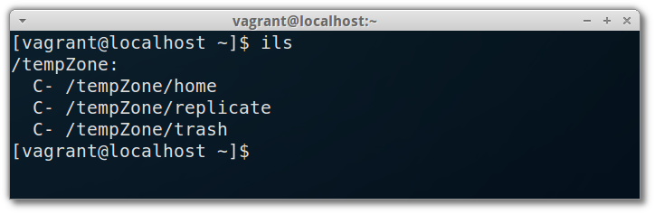

# A Vagrant / Ansible config with iRODS4 and the B2SAFE module



## Introduction

This is a [Vagrant](https://www.vagrantup.com) box with
[Ansible](http://www.ansible.com) provisioning that will automatically
set up a [VirtualBox](https://www.virtualbox.org) virtual machine with
[iRODS4](http://irods.org), and the [B2SAFE](http://www.eudat.eu/b2safe)
module developed by [EUDAT](http://www.eudat.eu), for automatic
replication of data between B2SAFE-enabled iRODS zones.

This installation is an effort at documenting (with "executable code")
a pilot project within [Elixir Europe](http://www.elixir-europe.org),
for setting up a test replication of proteomics data between
[BILS](http://www.elixir-europe.org) in Sweden, and
[EBI](http://www.ebi.ac.uk) in the UK.

## Requirements

Executing this "vagrant box" requires the following softares installed:

- [Vagrant](https://www.vagrantup.com)
- [Ansible](http://www.ansible.com)
- [VirtualBox](https://www.virtualbox.org)

## Getting started

### Install dependencies

Check the websites of the various softwares under "Requirements" above, for install instructions.

### Download and start

To get started using this machine, clone this repository, and then run `vagrant up`:

```bash
git clone https://github.com/BILS/irods-b2safe-vagrant.git
cd irods-b2safe-vagrant
vagrant up
```

### Log in with SSH

To log in to one of the newly created virtual machines (the master or the slave), do:

```bash
vagrant ssh master
```
or:
```bash
vagrant ssh slave
```
respectively.
